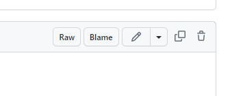

# DAE Solution Storage


# How to: Add a file

To add a Collada file (```.dae``` extension file), firstly create a directory with the name of the file.

For example the ``Unit_Sphere.dae`` will be stored in the ``Unit_Sphere/`` directory.

All the textures and files concerning the collada file will be then stored in the same directory path, and will ease its use.

# How to: Use a file in Google Earth Pro or another

To consult and use the file, you should click on the folder you're interested in.
For this case it will be the ``Unit_Sphere/`` folder.


Once you're in the folder, you'll see the ``Unit_Sphere.dae`` file, which is our collada file we're interested in.


To consult its code, we just have to click it.

and if we want to use it, we click on the ``view raw`` button that is on the top right of the viewer.



And here it is, the raw code of the file, we just have to copy the url, and we're good to go.
You should have a url like this: https://raw.githubusercontent.com/AntoineRovini/collada_files/main/Unit_Sphere/Unit_Sphere.dae